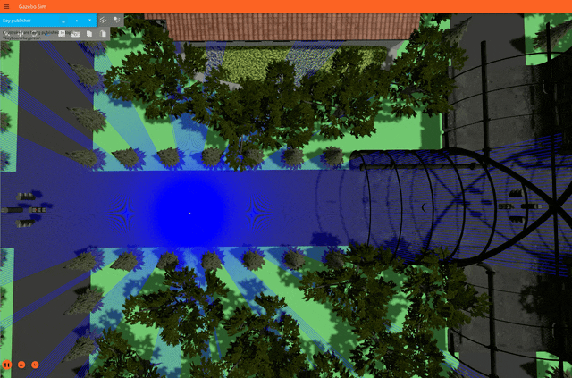

# Autonomous Vehicle Mapping and Navigation

[](https://releases.ubuntu.com/24.04/)
[](https://docs.ros.org/en/kilted/index.html)
[](https://gazebosim.org/docs/ionic/)
[](https://www.python.org/downloads/release/python-3100/)
[](https://opensource.org/licenses/MIT)

<insert>


## 1. Overview

This repository provides a full pipeline that enables autonomous driving on a hatchback vehicle in Gazebo Sim, from environment mapping to autonomous navigation. The vehicle is equipped with a roof-mounted GPU LiDAR with a 10Hz frequency and 360° visibility. Users can manually operate the vehicle via a keyboard interface to explore the Gazebo world we built for this project.

<p align="center">
  <br>
</p>

<div id="slam-overview">
As the vehicle explores the world, it utilizes SLAM (Simultaneous Localization and Mapping) to process LiDAR point clouds. This creates an occupancy grid map of the surroundings in real-time.
</div><br>

<p align="center" id="slam-overview">
  <br>
</p>

With the generated map, the vehicle can calculate an optimal trajectories to reach user-defined goals using the MPPI (Model Predictive Path Integral) controller. The vehicle will move autonomously based on the predicted trajectory.

<p align="center" id="nav-overview">
  <br>
</p>

> [!NOTE]
> This project represents the final project for the *Automated Systems* course at Huazhong University of Science and Technology (HUST). You can find my personal ROS 2 study notes [here](https://jianglanwei.github.io/notes/ros2/).


## 2. Installation

### Step 1: Install ROS 2 and Gazebo

Pick a [ROS 2 release](https://docs.ros.org/en/kilted/Releases.html) that is compatible with your Ubuntu version. For Ubuntu 24.04, [install Kilted Kaiju](https://docs.ros.org/en/kilted/Installation/Ubuntu-Install-Debs.html). This is the targeted version for this repository. For long-term support on Ubuntu 24.04, [install Jazzy Jalisco](https://docs.ros.org/en/jazzy/Installation/Ubuntu-Install-Debs.html). For Ubuntu 22.04, [install Humble Hawksbill](https://docs.ros.org/en/humble/Installation/Ubuntu-Install-Debs.html).

After installing your ROS 2 release, install the matching Gazebo version (see [possible combinations](https://gazebosim.org/docs/jetty/ros_installation/#:~:text=Summary%20of%20Compatible%20ROS%20and%20Gazebo%20Combinations)). You must also install the `ros_gz` package suite to bridge Gazebo and ROS together. Refer to the [Gazebo/ROS 2 pairing guide](https://gazebosim.org/docs/jetty/ros_installation/#:~:text=Installing%20the%20Default%20Gazebo/ROS%20Pairing) to install the correct version of Gazebo and `ros_gz` for your ROS installation on a Linux system.

### Step 2: Install Navigation 2 and SLAM Toolbox

Install Navigation 2 via the [official Nav2 page](https://docs.nav2.org/getting_started/index.html#getting-started). This installation also includes RViz, which visualizes the generated maps in this project. 

We highly recommend following the Turtlebot 3 setup instructions on the Nav2 page. Running the Turtlebot navigation example is the best way to verify that your ROS 2 and Gazebo bridge are communicating correctly before attempting to launch this repository.

Next, [install the SLAM Toolbox](https://docs.nav2.org/tutorials/docs/navigation2_with_slam.html). We suggest following the tutorial to test the toolbox in a standard environment to ensure all binaries were downloaded and configured properly.

### Step 3: Clone this repository

Clone this repository with:

```
git clone https://github.com/jianglanwei/slam
cd slam
```

### Step 4: Build ROS 2 packages

This repository includes two ROS 2 packages located in the `src/` folder: 

1. `traffic_ctrl` manages the logic and timing for all traffic lights within the Gazebo world.
2. `keyboard_listener` captures the keyboard inputs and publishes motion commands and trigger service calls. 

To build these packages, navigate to the root of your workspace (`slam/`) and run:

```
colcon build --symlink-install --packages-select traffic_ctrl keyboard_listener
```

After the build completes, `colcon` will have created three new folders: `build/`, `log/` and `install/`. To allow ROS 2 to recognize the packages, you must source the setup file in *every new terminal* you open:

```
source install/setup.bash
```

## 3. Run SLAM and Generate Map

> [!IMPORTANT]
> Do not forget to source the setup file in *every new terminal* you open:
> ```
> source install/setup.bash
> ```

Launch `slam_launch.py` to start the SLAM mapping pipeline:

```
ros2 launch slam_launch.py
```

Refer to [this teaser video](#slam-overview) to ensure the environment initializes correctly. Two windows should appear:

1. **Gazebo Sim:** A simulation window featuring a hatchback parked on a tree-lined road, with the camera following the vehicle.
2. **RViz2:** A visualization window displaying the real-time occupancy grid map as it is generated by the LiDAR data.

To drive the hatchback and explore the world, ensure the Gazebo window is selected (has focus) so it can capture your keystrokes:

<div align="center">

|     Key     |    Action    | Lin. Vel. | Ang. Vel. |
|:-----------:|:------------:|:---------:|:---------:|
| <kbd>w</kbd>| Move Forward |    3.0    |    0.0    |
| <kbd>x</kbd>| Move Backward|   -3.0    |    0.0    |
| <kbd>a</kbd>|  Turn Left   |    3.0    |    0.5    |
| <kbd>d</kbd>|  Turn Right  |    3.0    |   -0.5    |
| <kbd>s</kbd>|     Stop     |    0.0    |    0.0    |

</div>

Once you have mapped the environment, press <kbd>m</kbd> to save the current map. Your map will be saved in the `maps/` directory as `map_[timestamp].yaml` (the metadata) and `map_[timestamp].pgm` (the image file).

> [!WARNING]
> To shut down the simulation and all associated nodes, always press <kbd>Ctrl</kbd> + <kbd>C</kbd> in the terminal where the launch command is running.  
> 
> *Do not close the windows directly.* Closing windows manually leave "ghost nodes" active in the background, which may cause malfunction (such as traffic light timing errors) in your next session. If you suspect nodes from a previous session are still active, please refer to the [troubleshooting](#5-troubleshooting) section.

## 4. Autonomous Navigation with MPPI
> [!IMPORTANT]
> Do not forget to source the setup file in *every new terminal* you open:
> ```
> source install/setup.bash
> ```


Launch `nav_launch.py` to initialize everything for navigation:

```
ros2 launch nav_launch.py
```

By default, this loads `map_default.yaml`. To use a custom map you generated earlier:

```
ros2 launch nav_launch.py map_file:=maps/[your_map].yaml
```

[The teaser video](#nav-overview) illustrates how to select the start and goal positions once the Gazebo Sim and RViz2 windows appear. First, press *2D Pose Estimate* in the RViz upper sidebar to set the vehicle's starting location (this must match its actual location in Gazebo). Then, use *2D goal pose* to select your destination. The hatchback should begin driving towards the goal once both positions are selected.

> [!TIP]
> If the vehicle does not move after you select both positions, Nav2 may have missed one of the signals. Selecting the start the goal positions again usually resolves this.


## 5. Troubleshooting

If the simulation is terminated improperly (e.g., closing the Gazebo window directly instead of pressing <kbd>Ctrl</kbd> + <kbd>C</kbd> in the terminal), some ROS 2 processes may continue to run as "ghost nodes". These background processes can interfere with subsequent runs, leading to issues like malfunctioning traffic lights or communication failures between nodes.

If you suspect ghost nodes are interfering with your simulation, follow these steps to reset your environment:

1. Shut down the current process by pressing <kbd>Ctrl</kbd> + <kbd>C</kbd> in your terminal.
2. List all active ROS 2 nodes:
   
    ```
    ros2 node list
    ```
    If the list is not empty despite no active launch files, nodes from previous sessions are still hanging in the background.
3. Stop the ROS 2 daemon to clear the discovery cache:
    ```
    ros2 daemon stop
    ```
4. Verify the environment is clean by listing the nodes again:
    ```
    ros2 node list
    ```
5. Re-launch the pipeline. Your next run should now initialize successfully.
